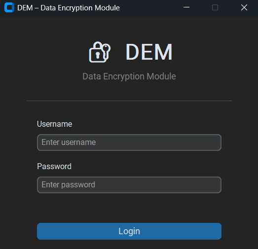
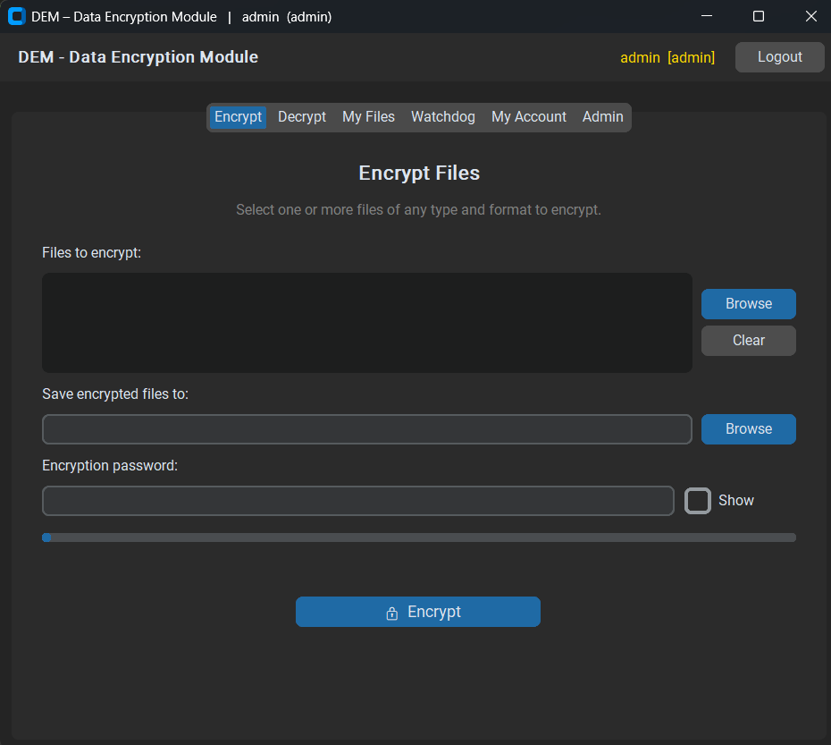
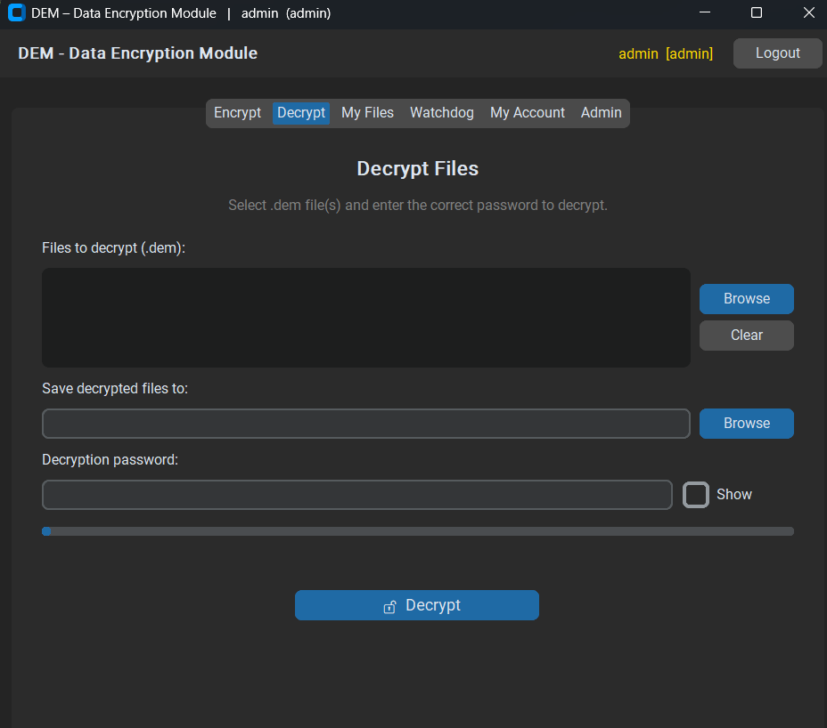
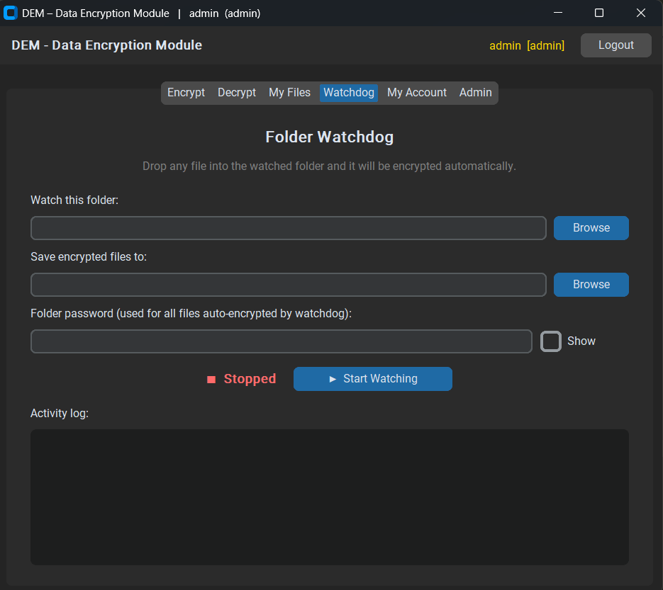
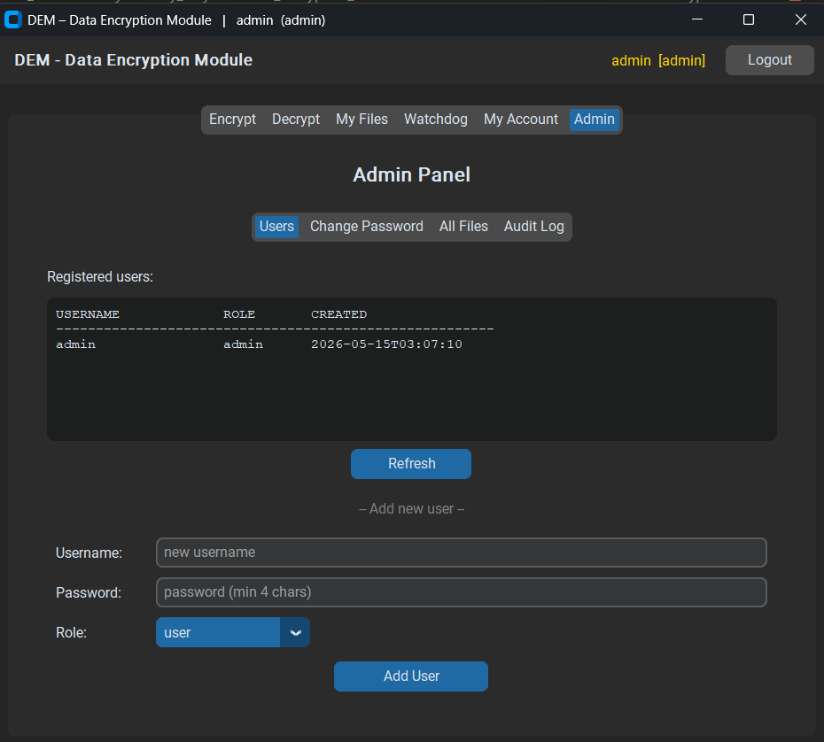

# DEM — Data Encryption Module 🔐

DEM (Data Encryption Module) is a secure desktop-based file encryption system built using Python.

The application implements AES-256-GCM authenticated encryption, role-based access control (RBAC), real-time folder monitoring, audit logging, and secure password-based key derivation through a modern CustomTkinter GUI.

Designed as a practical cybersecurity project, DEM focuses on secure file protection while maintaining usability and performance.

---

## Features

- AES-256-GCM authenticated encryption
- PBKDF2-SHA256 key derivation
- Role-Based Access Control (Admin/User)
- Automatic folder watchdog monitoring
- Tamper-evident audit logging
- Secure session management
- Chunked file encryption for large files
- SQLite-based encrypted file registry
- Modern dark-mode GUI using CustomTkinter
- Ownership-based decryption enforcement

---

## Technology Stack

| Component | Technology |
|---|---|
| Language | Python 3.10+ |
| GUI Framework | CustomTkinter |
| Encryption | AES-256-GCM |
| Key Derivation | PBKDF2-HMAC-SHA256 |
| Database | SQLite3 |
| Monitoring | watchdog |
| Cryptography Library | PyCA cryptography |

---

## Project Structure

```text
Data_Encryption_Module/
│
├── auth/                 # Authentication & RBAC
├── core/                 # Encryption & decryption logic
├── gui/                  # GUI components
├── storage/              # Database & audit logging
├── watchdog_monitor/     # Real-time folder monitoring
├── main.py               # Application entry point
├── requirements.txt
└── README.md
```

---

## Encryption Standard

DEM uses:

- AES-256-GCM for authenticated encryption
- PBKDF2-HMAC-SHA256 for secure key derivation
- 600,000 PBKDF2 iterations
- Unique random salt and nonce per file

This ensures:
- Confidentiality
- Integrity protection
- Resistance against brute-force attacks
- Protection against nonce reuse

---

## Key Security Features

### Role-Based Access Control (RBAC)
- Admin and User roles
- Ownership-based decryption restrictions
- Admin-only management controls

### Audit Logging
All important operations are logged:
- Encryption
- Decryption
- Watchdog events
- Administrative actions

### Folder Watchdog
Automatically encrypts newly added files in monitored directories using real-time filesystem monitoring.

---

## Installation

### Clone the Repository

```bash
git clone https://github.com/Zaeem-Alpha/Data-Encryption-Module.git
cd Data-Encryption-Module
```

### Install Dependencies

```bash
pip install -r requirements.txt
```

### Run the Application

```bash
python main.py
```

---

## Default Admin Credentials

```text
Username: admin
Password: admin123
```

⚠️ Change the default admin password immediately after first login.

---

## Screenshots

### Login Window


### Encrypt Tab


### Decrypt Tab


### Watchdog Monitor


### Admin Panel


---

## Future Improvements

- Multi-factor authentication
- Secure encrypted session storage
- Password recovery mechanism
- Secure cloud backup support
- Dark/light theme switching
- Executable packaging for Windows/Linux/macOS

---

## Educational Purpose

This project was developed for educational and practical cybersecurity learning purposes, focusing on applied cryptography, secure authentication systems, and secure software design principles.

---

## Author

**M. Zaeem Bilal**  
Cybersecurity Student | Aspiring Offensive Security Specialist

---

## License

This project is licensed under the MIT License.